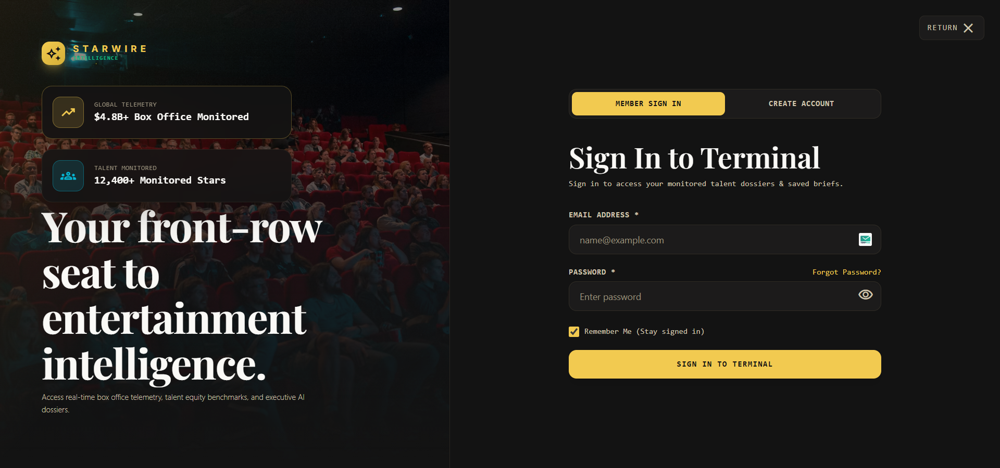
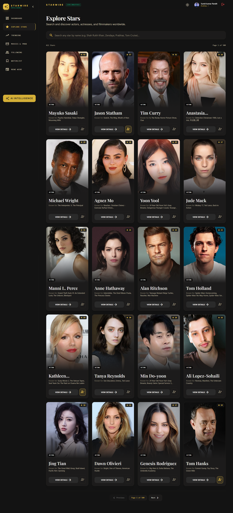
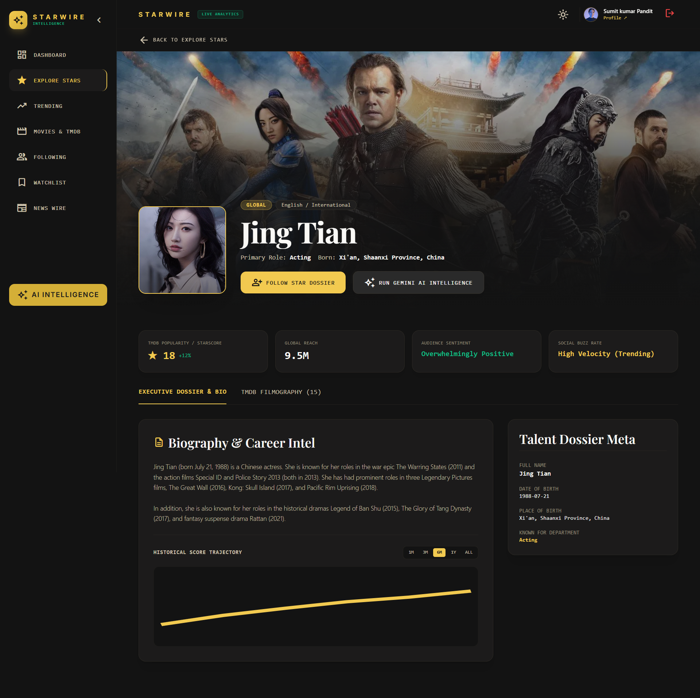
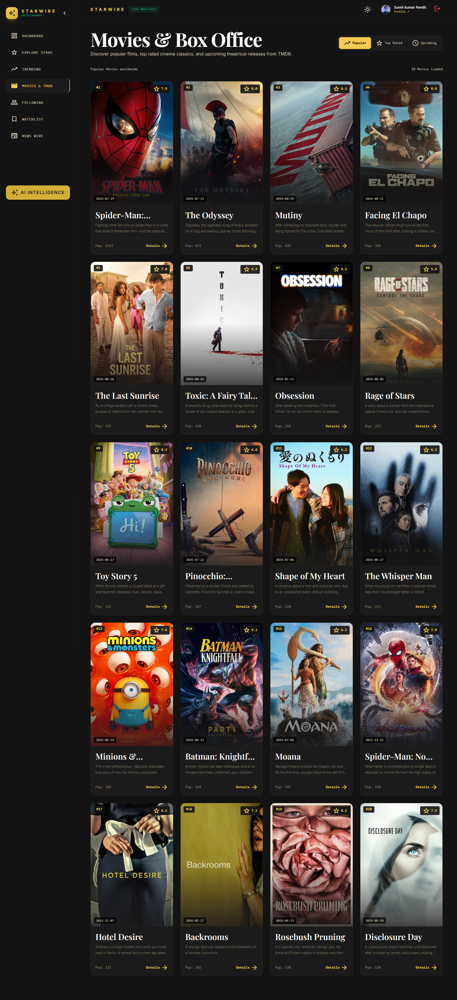
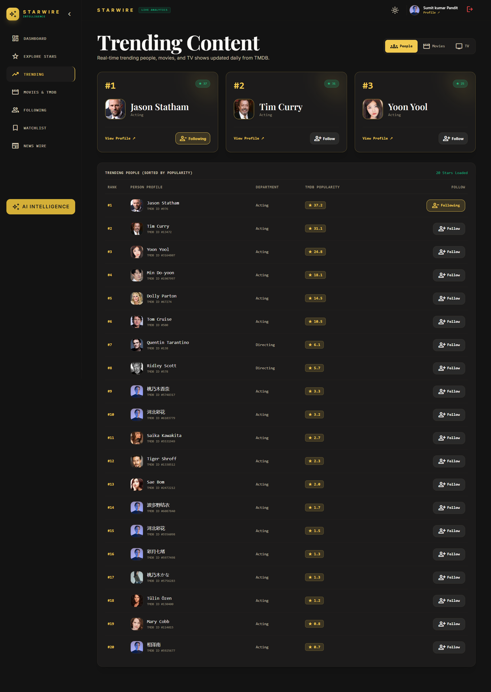
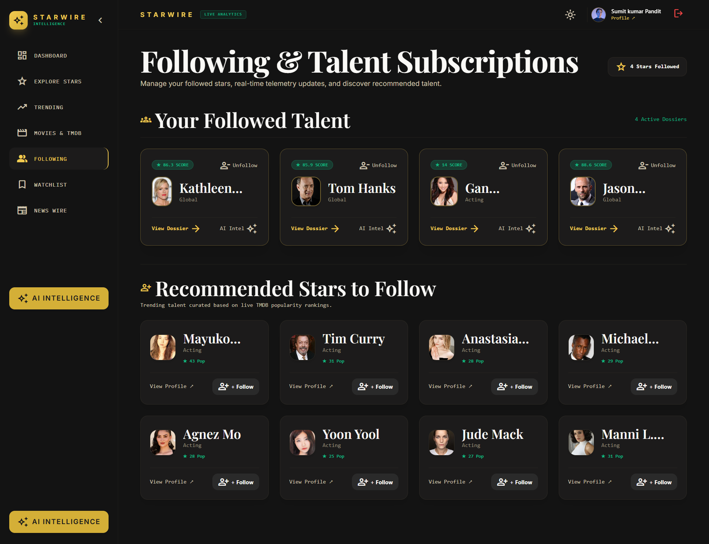
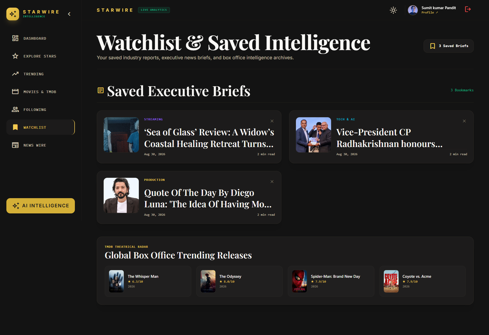

# 🌟 STARWIRE INTELLIGENCE

> **The Executive Intelligence Terminal for Global Cinema & Talent Equity**

STARWIRE INTELLIGENCE is an enterprise-grade entertainment intelligence platform engineered for producers, studio executives, distributors, and talent agencies. It synthesizes proprietary **StarScore™** talent equity benchmarks, **AI-powered predictive intelligence**, and live theatrical box office telemetry from **TMDB**.

---

## 🎬 Project Screenshots & Media Showcase

### 📹 Full Demo Video
Watch the interactive walkthrough video:  
👉 **[Watch Demo Video (`https://drive.google.com/file/d/1o9PFCtkDYmnml2GvI-n_C-4KR6NbB8LT/view?usp=sharing`)](https://drive.google.com/file/d/1o9PFCtkDYmnml2GvI-n_C-4KR6NbB8LT/view?usp=sharing)**

---

### 📷 Application Screen Showcase

| Landing Page | Member Sign In & Authentication |
| :---: | :---: |
|  |  |

| AI Starwire Intelligence Dossier | Explore Talent Index (50+ Stars) |
| :---: | :---: |
|  |  |

| Star Dossier & Career Deep-Dive | Live TMDB Box Office & Movies |
| :---: | :---: |
|  |  |

| Trending Stars & BuzzMeter™ | Industry Dispatches & News Wire |
| :---: | :---: |
|  |  |

| Tracked Stars (Following) | Saved Intel Briefs (Watchlist) |
| :---: | :---: |
|  |  |

---

## 🏗️ System Architecture

```
                                  ┌──────────────────────────────────────────┐
                                  │           STARWIRE FRONTEND              │
                                  │  (React 19 + TypeScript + Vite 6)        │
                                  │  • Zustand State Management              │
                                  │  • Tailwind CSS v4 Theme Engine          │
                                  └────────────────────┬─────────────────────┘
                                                       │
                                            HTTP / REST API Requests
                                                       │
                                                       ▼
                                  ┌──────────────────────────────────────────┐
                                  │            STARWIRE BACKEND              │
                                  │    (Node.js + Express + TypeScript)      │
                                  │  • JWT Auth & Password Hashing (Bcrypt)  │
                                  │  • Proxy Controller & Rate Limiter       │
                                  └───────────┬──────────────────┬───────────┘
                                              │                  │
                      ┌───────────────────────┘                  └───────────────────────┐
                      ▼                                                                  ▼
        ┌──────────────────────────┐                                       ┌──────────────────────────┐
        │     MONGODB DATABASE     │                                       │     EXTERNAL SERVICES    │
        │  • User Accounts & Auth  │                                       │  •  AI API  │
        │  • Tracked Talent Lists  │                                       │  • TMDB Telemetry Stream │
        │  • Saved Briefs          │                                       │  • Nodemailer Verification│
        └──────────────────────────┘                                       └──────────────────────────┘
```

---

## ✨ Key Features

- 📊 **StarScore™ & BuzzMeter™ Engine**: Algorithmic metrics calculating talent commercial pull, social reach, and audience sentiment out of 100.
- 🤖 ** Executive AI Terminal**: Instant AI-generated talent dossiers, box office projections, and risk assessments powered by Openrouter API.
- 🍿 **Live TMDB Theatrical Stream**: Real-time tracking of popular, top-rated, and upcoming global theatrical releases with detailed modal breakdowns.
- 📰 **Industry News Wire & Dispatches**: Categorized intelligence briefs with impact scores and read time indicators.
- 🔒 **Secure Executive Authentication**: JWT token-based auth with bcrypt password encryption, persistent session management, and multi-step 6-digit email reset flows.
- 🌗 **Adaptive Dual Theme Engine**: Seamless switching between **Obsidian Dark Mode** and **Ivory Light Mode** with zero contrast loss across all viewports.
- 📱 **Mobile First & Fully Responsive**: Responsive bento grids, mobile drawer navigation, horizontal scrolling tables, and 1-star-per-row mobile layouts.

---

## 🛠️ Tech Stack & Dependencies

### Frontend
- **Framework**: React 19, TypeScript
- **Build Tool**: Vite 6
- **Styling**: Tailwind CSS v4, Vanilla CSS Custom Variables
- **State Management**: Zustand v5
- **Routing**: React Router DOM v7
- **Icons & Fonts**: Google Material Symbols Outlined, Playfair Display, Inter, IBM Plex Mono

### Backend
- **Runtime & Server**: Node.js, Express.js (TypeScript with `tsx`)
- **Database**: MongoDB & Mongoose ORM
- **Security**: JWT (`jsonwebtoken`), `bcryptjs`, CORS, Dotenv
- **Mail Service**: Nodemailer (6-digit verification dispatch)
- **APIs Integrated**: Openrouter  AI API (`@google/genai`), TMDB API (The Movie Database)

---

## 🚀 Local Development Setup

### 1. Prerequisites
- **Node.js**: v18.0.0 or higher
- **npm**: v9.0.0 or higher
- **MongoDB**: Local instance or MongoDB Atlas Connection String

---

### 2. Environment Configuration

Create a `.env` file in the root directory:
```env
VITE_BACKEND_URL="http://localhost:5000"
```

Create a `.env` file in the `backend/` directory:
```env
SMTP_HOST="smtp.gmail.com"
SMTP_PORT=587
SMTP_USER="[EMAIL_ADDRESS]"
SMTP_PASS="..."
SMTP_FROM='"STARWIRE Security" <[EMAIL_ADDRESS]>'
PORT=5000
MONGODB_URI="...."
JWT_SECRET="...."
TMDB_API_KEY="...."
TMDB_READ_ACCESS_TOKEN="...."
OPENROUTER_API_KEY="...."
OPENROUTER_MODEL="...."
```

---

### 3. Installation & Run

#### Start Frontend (Client)
```bash
npm install
npm run dev
```
Client dev server runs at: `http://localhost:5173`

#### Start Backend (API Server)
```bash
cd backend
npm install
npm run dev
```
Backend API server runs at: `http://localhost:5000`

---

## 📄 License
This project is licensed under the **MIT License**.
